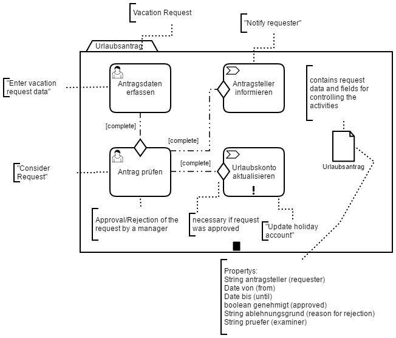

# Installation Instructions for the „Vacation Request“ („Urlaubsantrag“) Example

The example application „Vacation Request“ is pre-configured for a MySQL connection and a TomEE application server using EclipseLink as a JPA reference implementation and CXF for processing HTTP-requests to the REST interfaces. The example has been developed and tested in the following environment:

*	[Eclipse Photon Release 4.8.0](https://www.eclipse.org/photon/)
*	MySQL MariaDB 10.1.37 (e.g. via [ApacheFriends XAMPP Version 7.3.0](https://www.apachefriends.org/en/download.html)) 
*	[TomEE PLuME 7.1.0](http://tomee.apache.org/download-ng.html) (built on an Apache Tomcat Version 8.5.32)
*	JRE/JDK 1.8.0_211

# CMMN Case Model "Vacation Request" ("Urlaubsantrag")

The example application realizes the CMMN case model shown below. There are two HumanTasks: One to enter an employee's vacation request data, the other to examine and approve or reject it. Two ProcessTasks are used; one notifies the employee based of the outcome, the other updates the requester's holiday account if the request has been approved. Data of the request and for steering the case is modeled as properties of the CaseFileItem "Urlaubsantrag" ("vacation request").

Several steps are necessary to run the example. You can either check out the project from here or download the pre-packaged TomEE-distribution from [the project website](https://www.fh-bielefeld.de/wug/forschung/ag-pm/cama-frame). You will need to set up a database and run a JUnit test class to run the example.

## **1.	Import the project:**
You can import the project via a git plugin or the downloaded project archive in Eclipse via File -> Import… and „Import Projects from Folder or Archive“ as a Maven project.

## **2.	Prepare the database:**
Create a MySQL-Database named „urlaubsantrag“ ("vacation request"). The schema is generated with the help of JPA and by running a JUnit test class. As a JDBC-URL `jdbc:mysql://localhost:3306/urlaubsantrag` is pre-configured.

This configuration can be changed in two places:

a)	In the persistence.xml (see `/CaMaFrameUrlaubsantrag/src/main/java/META-INF/persistence.xml`) of the project

b)	In the TomEE application server (see `tomee\conf\server.xml`)

In a) the `<persistence-unit name="urlaubsantragLocal">` is defined. It contains login data and is configured as an application-managed EntityManager which is used in the aforementioned JUnit test class.
  
In b) an application server managed resource is configured as `<Resource name="urlaubsantrag" >` which will later be used by the example. It is also referenced in a) as  `<persistence-unit name="urlaubsantrag">` and contains login data and the URL for your database setup.

_**Note: Should you want to change the name of the persistence unit, you have to change the name accordingly in the class found at /CaMaFrameUrlaubsantrag/src/main/java/cm/core/utils/PersistenceSettings.java and follow the instructions below.**_

## **3.	Run the JUnit test class:**
Once your database is available, run the class `/CaMaFrameUrlaubsantrag/src/test/java/ResetDataBaseTest.java` as a JUnit test. You can watch the table structure being built and the two users being persisted in your console (entries marked with [EL] for EclipseLink).

## **4.	Start TomEE:**
*	If you have **not** changed the database configuration: After you have prepared your database and run the JUnit test class, you can start the application server. If you are not using the bundled distribution, create a deployable .war file from your project and deploy it on the server by copying the file to `tomee\webapps\`.

*	If you **have** changed the database configuration: Undeploy any previous version of the application example in `tomee\webapps\` including any .war-files. Compile the project and create a deployable .war-file. Copy it to `tomee\webapps\`. You should be able to see the deployment being automatically picked up by TomEE in its console.

## **5.	Access the example application:**
You can now access the example application at URL http://localhost:8080/Urlaubsantrag/welcome. There are two logins available (which were created by running the JUnit test class):

*	„John Admin“ user/pass: admin/admin (has role: pruefer)
*	„Jane Worker“ user/pass: worker/worker (has role: bearbeiter)

The worker account can enter the request data while the admin account can verify the request. Included are two simple graphical user interfaces to view case instances and task instances. Please note to select a task in the grid first before starting it.
